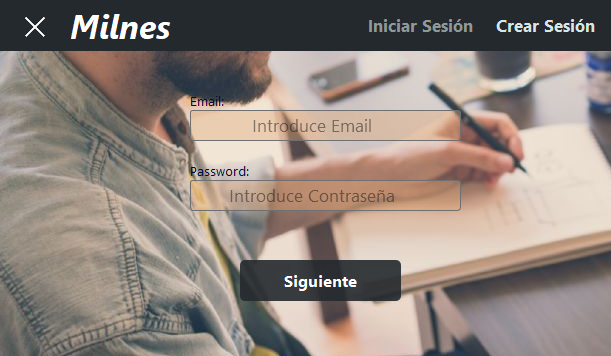

# Milnes_GUI
Aplicación de Sesión hecha con Python 3 con Interfaz Gráfica, creado para mostrar el potencial de PyQt5, incluye una base de datos(local) para poder manejar los registros de los usuarios.

***

### Para Empezar:
- Abrir .\Milnes_GUI-master\dist\run.exe o si tienes instalado Python 3 abrir el run.pyw.
 ### Versión: 1.2.1

## Si te aparece algún fallo notifícamelo para arreglarlo.
#### Versión Requerida >= python 3.6
